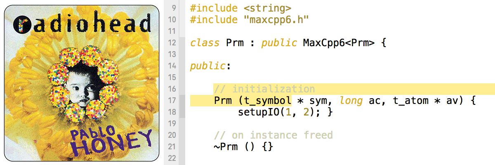

# Radiohead Xcode themes

Syntax highlighting based on the colour palettes of Radiohead’s album covers, designed with readability/navigability in mind, and covering the whole bright-to-dark spectrum to cater for all lighting conditions.

## Installation

Clone repo:

    $ git clone https://github.com/jeevn/rh-xcode

Move theme files:

    $ cd rh-xcode/themes
    $ mv *.dvcolortheme ~/Library/Developer/Xcode/UserData/FontAndColorThemes/

Now relaunch Xcode, the themes should appear in Preferences.

## Licence
[CC BY-SA 4.0](http://creativecommons.org/licenses/by-sa/4.0/)
